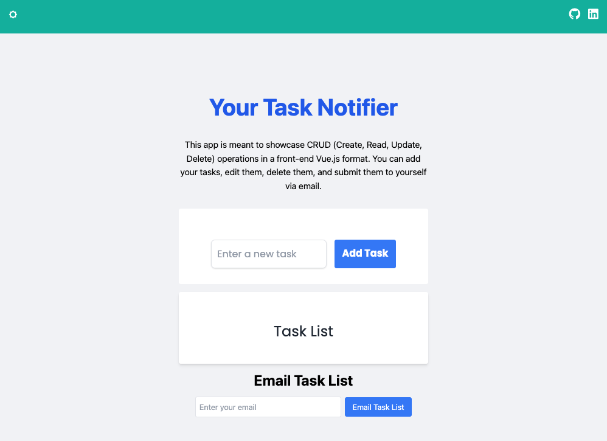
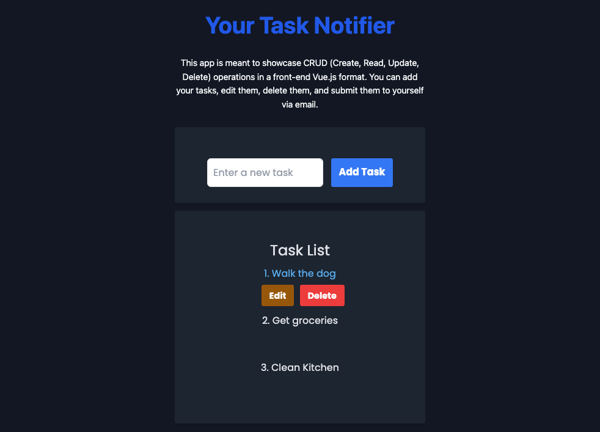

# 📝 Task Notifier 📝

Task Notifier is a web application that allows users to manage their tasks effectively. It provides functionality for creating, editing, and deleting tasks, as well as the ability to submit the task list to the user's email address.

This project serves as a demonstration of CRUD (Create, Read, Update, Delete) operations in a front-end Vue.js format, showcasing the capabilities of Vue.js, JavaScript, Tailwind CSS, HTML, and CSS. By leveraging these technologies, Task Notifier provides a user-friendly interface for managing tasks.

The application allows users to add new tasks, edit existing ones, and delete tasks they no longer need. The task list is dynamically updated in real-time, providing a seamless user experience. Additionally, users can submit their task list to their email address, ensuring they have a copy for reference.

## Live Website 🌐

### [Task Notifier](https://task-notifier.vercel.app/)

## Developer 🤝

### 🧑‍💻 [David Benner](https://github.com/davebenner14)

## Technologies Used 💻

-   [Vue.js](https://vuejs.org/guide/introduction.html)
-   [JavaScript](https://developer.mozilla.org/en-US/docs/Web/JavaScript)
-   [Tailwind](https://tailwindcss.com/)
-   [HTML](https://developer.mozilla.org/en-US/docs/Web/HTML)
-   [CSS](https://developer.mozilla.org/en-US/docs/Web/CSS)


## Screenshots 📸




## Getting Started Yourself 🚀

To get started with this project, follow these steps:

First, install Vue CLI, if you haven't already, using the following command:

```
npm install -g @vue/cli
```

Create a new Vue.js project using:
```
vue create <project name>
```
Install the required dependencies:
```
npm install
```
Test your application:
```
npm run serve
```
## Components 📚

The project consists of several components that work together to manage tasks and provide email functionality. Here are some examples:

### TaskForm.vue
The TaskForm component is responsible for rendering a form where users can input new tasks. It provides an interface for users to enter task details and submit them to be added to the task list.

```
<template>
  <div>
    <form @submit="addTask">
      <input v-model="newTask" type="text" placeholder="Enter a new task" />
      <button type="submit">Add Task</button>
    </form>
  </div>
</template>

<script>
export default {
  data() {
    return {
      newTask: ''
    };
  },
  methods: {
    addTask() {
      // Logic to add the task
      // For example, you can emit an event or call a method in the parent component
      // to handle the task addition and update the task list
      this.$emit('task-added', this.newTask);
      this.newTask = ''; // Clear the input after submitting
    }
  }
}
</script>
```

### TaskList.vue
The TaskList component is responsible for rendering the list of tasks. It receives an array of tasks as a prop and dynamically generates the list items to display each task's title. It provides a visual representation of the tasks stored in the application and allows users to view their existing tasks.
```
<template>
  <div>
    <ul>
      <li v-for="task in tasks" :key="task.id">
        {{ task.title }}
      </li>
    </ul>
  </div>
</template>

<script>
export default {
  props: {
    tasks: {
      type: Array,
      required: true
    }
  }
}
</script>

<style>
/* Your component styles here */
</style>
```
## Going Forward 🚀
Keep exploring and experimenting with Vue.js! There are endless possibilities to enhance your Task Notifier application. Consider adding authentication, implementing task filtering and sorting, integrating with backend APIs, and deploying your application online. Remember, the best way to become proficient is by hands-on experience. Happy coding!